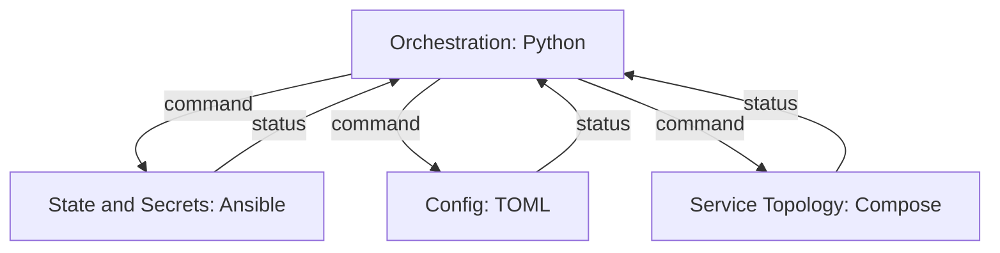
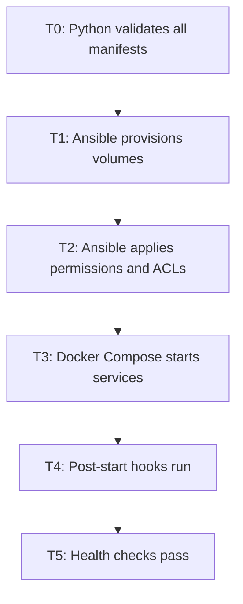

# Architecture

Concerns are divided among tools with strict unidirectional data flow. Each concern has exactly one owner; contracts between concerns are declared explicitly and enforced mechanically.

See `PLAYBOOK.md` for the design process that produced this document.

* * *

## Tools & Responsibilities

| Concern | Tool | Role | Key Principles |
| --- | --- | --- | --- |
| State & Secrets | **Ansible** | Central data fortress — service manifests, secrets (Vault), permissions, volume provisioning, infrastructure state | Each service declares its own storage footprint in `ansible/manifests/<service>.yml`; `group_vars/all.yml` holds infrastructure-level concerns only; secrets encrypted via Vault; never queried mid-reconciliation |
| Orchestration | **Python + Pydantic** | Issues commands to all other concerns; receives status; sole authority on sequencing and error handling | All data crossing a module boundary is a Pydantic model or typed primitive; no `dict`, `Any`, or untyped structures; manifests validated at T0 before any command is issued |
| Service Topology | **Docker Compose** | Declares what services exist, how they run, and how they connect — images, healthchecks, port bindings, restart policies | Owns runtime service definitions only; infrastructure prerequisites belong to Ansible; UIDs and paths consumed from manifests via contract validation |
| Config | **TOML** | Python-consumed runtime config — feature flags, timeouts, service URLs, behaviour toggles | No infrastructure, no secrets; parsed into Pydantic models via `tomllib` (3.11+); denotes Python ownership by format |

**Jinja2** is available as a sub-concern of Ansible for rendering container-level config files into bind-mount paths. Optional — only present when services require rendered configs. Never used for project toolchain files.

**All executable scripts must be Python.** Entry points defined in `pyproject.toml` `[project.scripts]`; invoked as `python -m module`.

**Develop via WSL targeting base Debian compatibility.** See `CONTRIBUTING.md` for setup.

* * *

## Contracts

**All data flow between concerns is unidirectional.** All contracts route through Orchestration — Orchestration issues commands, concerns return status. No concern communicates with another directly.



| From | To | Interface | Authority |
| --- | --- | --- | --- |
| Orchestration | State & Secrets | Command to provision — validate manifests, create accounts, provision volumes, apply ACLs | Orchestration |
| State & Secrets | Orchestration | Status — completion or structured error per manifest | Orchestration |
| Orchestration | Config | Command to load runtime config | Orchestration |
| Config | Orchestration | `AppConfig` Pydantic model | Orchestration |
| Orchestration | Service Topology | Command to start services | Orchestration |
| Service Topology | Orchestration | Status — services up or structured error | Orchestration |

### Startup Sequence



T0 is a Python gate — no command is issued to any concern until all manifests pass Pydantic validation. A malformed manifest halts the orchestrator before anything is provisioned.

* * *

## Service Manifest

Each service declares its own storage footprint. Ansible provisions from it; Python validates contracts against it; Compose consumes UIDs and paths derived from it.

**`ansible/manifests/<service>.yml`:**

Each manifest file contains a YAML list of service entries (one entry per service declared in that file).

```yaml
- service: api
  uid: 1001
  user: svc_api
  volumes:
    - name: data
      path: /srv/api/data
      mode: "0750"
    - name: logs
      path: /srv/api/logs
      mode: "0750"
  read_access:
    - svc_worker
```

**`docker-compose.yml`** — Service Topology owns images, healthchecks, and runtime config:

```yaml
services:
  api:
    image: myapp/api:latest
    user: "1001"
    volumes:
      - /srv/api/data:/app/data
      - /srv/api/logs:/app/logs
    healthcheck:
      test: ["CMD", "curl", "-f", "http://localhost:8080/health"]
      interval: 30s
      timeout: 10s
      retries: 3
    restart: unless-stopped
```

`ansible/roles/storage/` — reads each manifest; creates service accounts, provisions volume paths, sets permissions, applies `read_access` ACLs. No implicit cross-service access.

`ansible/roles/validate/` — runtime filesystem defense-in-depth check: asserts that every volume path listed in its manifest exists on disk and has the expected permissions. Does **not** perform Compose↔manifest parity enforcement — that is owned by `src/utils/validate_contract.py`.

* * *

## Python Layer

### Module Responsibilities

**`main.py`** — T0 gate and reconciler entry point. Calls `load_manifests()` and `validate_manifest()` — halts on any violation before issuing a single command. Calls `load_inventory()` and `load_config()` — deserialises into typed models. Sets up logging via `setup_logging()`. Instantiates `ReconcilerConfig` and starts the reconciliation loop. No business logic; no raw data types.

**`models/`** — pure Pydantic shapes. No I/O, no imports from anywhere else in `src/`. Every model is the authoritative shape for data crossing a concern boundary. See `MODELS.md` for full definitions.

**`reconciler/controller.py`** — `reconcile(desired, config, manifests)`. Compares desired and actual `SystemState`; consults `config.transition_map` for the next legal move; returns a typed command. Never reads files or calls subprocesses.

**`reconciler/observer.py`** — `observe() -> SystemState`. Queries current system state and coerces to a typed model. The only reconciler module that touches external state.

**`reconciler/transitions.py`** — transition map and legal move resolution. Pure logic — no I/O.

**`reconciler/model.py`** — `ReconcilerConfig`. Typed configuration for the reconciler — desired state, idempotency keys, retry policy.

**`utils/ansible.py`** — `load_inventory() -> AnsibleInventory`, `load_manifests() -> list[ServiceManifest]`. All raw YAML and subprocess output coerced to Pydantic models at ingestion. Raw data never leaves this module.

**`utils/config.py`** — `load_config(env: str) -> AppConfig`. Reads `config/{env}.toml`; returns a typed Pydantic model. Flags, timeouts, URLs only.

**`utils/validate_manifest.py`** — `validate_manifest(manifests: list[ServiceManifest]) -> ValidationResult`. Checks business rules: duplicate UIDs and duplicate volume paths. Self-referencing `read_access` and valid mode strings are checked by Pydantic model validators.

**`utils/validate_contract.py`** — `validate_contract(manifests: list[ServiceManifest], compose_path: str) -> ValidationResult`. Authoritative Compose↔manifest contract validator: asserts that every service in manifests is present in Compose, UIDs match, and all manifest volume paths are mounted. This is the single enforcement point for Compose↔manifest parity — run at T0 and invokable as `python -m src.utils.validate_contract`.

**`utils/validate_no_duplicates.py`** — Checks for overlap between TOML config and Ansible group vars.

**`utils/log.py`** — structured logging setup. Shared across all modules.

### Import Boundaries

```text
main.py         -> models/*, reconciler/*, utils/*
reconciler/*    -> models/* only
utils/*         -> models/* only
models/*        -> nothing
```

Enforced by `import-linter` on every push. `models/` is the foundation — no imports from anywhere else in `src/`. `reconciler/` never imports from `utils/`; it operates on typed models only. Raw data ingestion is entirely contained in `utils/`.

### The Pydantic Rule

Every value crossing a module boundary is a Pydantic model or a typed primitive. Raw parsed data — YAML blobs, JSON dicts, untyped subprocess output — is coerced at the point of ingestion and never passed further.

Banned: `dict`, `list` without type parameters, `Any`, `object`, untyped return values.
Required: Pydantic model or `str`, `int`, `float`, `bool`, `list[T]`, `tuple[T, ...]`.

* * *

## Project Structure

```tree
project/
├── ansible/
│   ├── manifests/                   # one file per service — storage source of truth
│   │   └── <service>.yml
│   ├── playbooks/
│   │   └── *.yml
│   ├── roles/
│   │   ├── storage/                 # volumes, users, ACLs — reads from manifests/
│   │   └── validate/                # asserts Compose matches manifests
│   ├── inventory/
│   │   └── hosts
│   ├── group_vars/
│   │   └── all.yml                  # infrastructure-level vars — UIDs, global policy
│   └── molecule.yml
├── config/
│   ├── dev.toml
├── runbook/
│   ├── quality-checks               # automates quality gates
├── src/
│   ├── main.py
│   ├── models/
│   │   ├── manifest.py              # ServiceManifest, VolumeSpec
│   │   ├── state.py                 # SystemState, StateLabel, TransitionMap
│   │   ├── contract.py              # ValidationResult, ContractViolation
│   │   ├── service.py               # ClusterState, ContainerState
│   │   └── ansible.py               # AnsibleHost, AnsibleInventory
│   ├── reconciler/
│   │   ├── controller.py
│   │   ├── observer.py
│   │   ├── transitions.py
│   │   └── model.py
│   └── utils/
│       ├── ansible.py
│       ├── config.py
│       ├── log.py
│       ├── validate_manifest.py
│       ├── validate_contract.py
│       └── validate_no_duplicates.py
├── tests/
├── docker-compose.yml
├── .pre-commit-config.yaml
└── pyproject.toml
```

* * *

## Architectural Checklist

- [ ] **Unidirectional Data Flow** — all contracts route through Orchestration; no concern communicates with another directly; a return path is a boundary violation
- [ ] **Single Ownership** — each concern has exactly one owner; shared ownership is a hidden bidirectional flow
- [ ] **Bounded Contexts** — Ansible: state & secrets; Python: orchestration; Compose: service topology; TOML: Python-consumed config
- [ ] **Manifest Authority** — each service's storage footprint declared once in `ansible/manifests/<service>.yml`; Ansible provisions from it, Compose consumes from it, Python validates against it
- [ ] **T0 Gate** — all manifests pass Pydantic validation before any command is issued; malformed manifests halt the orchestrator immediately
- [ ] **Pydantic Boundary** — every value crossing a module boundary is a Pydantic model or typed primitive; `dict`, `Any`, and untyped structures are banned
- [ ] **Import Boundaries** — `models/` imports nothing; `reconciler/` and `utils/` import from `models/` only; enforced by `import-linter`
- [ ] **Volume Isolation** — each volume owned by its service account at `0750`; cross-service read access via explicit `acl:` entries in manifest `read_access` only
- [ ] **Topology Boundary** — Compose owns images, healthchecks, and runtime service config; infrastructure prerequisites belong to Ansible manifests
- [ ] **Contract Validation** — `src/utils/validate_contract.py` is the authoritative Compose↔manifest parity check (service presence, UIDs, volume paths) run at T0; `ansible/roles/validate/` is a defense-in-depth runtime check (filesystem existence and permissions) that runs after provisioning — the two roles are complementary and do not duplicate each other
- [ ] **Startup Sequencing** — T0 -> T1 -> T2 -> T3 -> T4 -> T5; enforced by Reconciler transition map
- [ ] **Idempotency** — Ansible tasks idempotent; Reconciler uses idempotency keys; Compose defines declarative desired state
- [ ] **Secrets Isolation** — secrets in Ansible Vault only; never in manifests, TOML, or Compose
- [ ] **Observability** — structured logging from Python; Ansible task outputs captured; Docker healthchecks and Compose logs exposed
