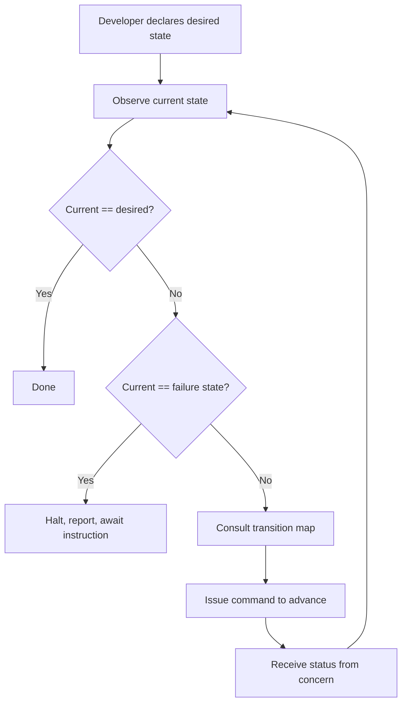

# Project Design Playbook

Language- and framework-agnostic. Complete these four steps before writing code.

## Foundational Constraints

Non-negotiable. If a design decision conflicts with any of these, the decision is wrong.

These constraints govern boundaries **between** concerns — not implementations within them.

**1. Data flows in one direction between any two concerns.** A return path means the boundary is wrong. Redraw it.

**2. Every concern has exactly one owner.** Shared ownership is a hidden bidirectional flow. If two tools write to the same concern, one is out of scope.

**3. Every rule must have an enforcement mechanism.** A rule without one is a suggestion. Review-only rules are temporary — treat them as candidates for automation.

* * *

## Step 1 — Divvy Concerns Among Tools

Assign each concern to exactly one tool. A tool may own more than one concern; no concern may have more than one owner.

| Concern | Responsibility | Examples |
| --- | --- | --- |
| **State & Secrets** | Declares desired system state; stores sensitive values. **Secrets must be encrypted or externally referenced — never plaintext alongside state.** Templating — rendering config files for consumption inside services — is a sub-concern of State & Secrets when needed; it is not a peer concern on projects that don't require it. | Ansible, Terraform, Pulumi |
| **Orchestration** | Issues commands to all other concerns in sequence; receives status in return; sole authority on sequencing and error handling. No concern communicates with another directly. | Python, Go, a shell pipeline |
| **Service Topology** | Defines what services exist, how they run, and how they connect — images, healthchecks, port bindings, restart policies. Owns runtime service definitions only; infrastructure prerequisites (volumes, permissions, accounts) belong to State & Secrets. | Docker Compose, Kubernetes, Nomad |
| **Config** | Runtime values that affect behaviour but aren't infrastructure — flags, timeouts, URLs. | TOML, environment variables, JSON |

### Output

| Concern | Owner |
| --- | --- |
| State & Secrets | |
| Orchestration | |
| Service Topology | |
| Config | |

If two concerns share an owner, note it explicitly. If State & Secrets requires templating, declare it as a sub-concern and name its owner. An unassigned concern is a gap — not a default.

- **State & Secrets** — the single source of truth; everything the system knows about itself
- **Orchestration** — the authority that decides what happens next and holds the project together
- **Service Topology** — the blueprint of what runs, how it runs, and how it connects; never what the infrastructure underneath it looks like
- **Config** — the dials and switches that change behaviour without changing code

* * *

## Step 2 — Declare Contracts Between Concerns

For every boundary where two concerns touch, answer:

1. **Interface** — what is exposed?
2. **Direction** — unidirectional only; bidirectional means the boundary is wrong
3. **Authority** — one owner; never negotiated at runtime

If a cell requires a bidirectional arrow, stop and redraw the boundaries.

### Contract Matrix

Under the Command model, all contracts route through Orchestration. The matrix has two directions for every active concern: Orchestration → Concern (command) and Concern → Orchestration (status). No concern has a direct contract with another.

| | Orchestration |
| --- | --- |
| **State & Secrets** | |
| **Service Topology** | |
| **Config** | |

For each non-empty cell, record:

```text
Command:   what Orchestration instructs the concern to do
Status:    what the concern returns on completion or failure
Authority: Orchestration — always
```

Contract enforcement — the rules and mechanisms that keep these boundaries honest — is declared separately in `CONTRIBUTING.md`.

### Sequencing Dependencies

Sequencing is owned entirely by Orchestration. The developer declares a desired state; the orchestrator observes the current state, consults the transition map, and issues commands one step at a time until the desired state is reached or a failure state is encountered.

`T0` is both the observed state on a fresh system and an explicit commandable reset — the orchestrator can always return to it intentionally.

#### State Table

The columns are project-defined — replace the step headings with whatever startup steps your project requires. The abstract template is:

| State | [Step A] | [Step B] | [Step N] | Description | Can Transition To |
| --- | :---: | :---: | :---: | --- | --- |
| `T0` | `·` | `·` | `·` | Clean slate | `T1` |
| `T1` | `OK` | `·` | `·` | Step A complete | `T2`, `F1`, `T0` |
| `Tn` | `OK` | `OK` | `OK` | Desired state reached | `T0` |
| `F1` | `OK` | `ERR` | `·` | Step B failed | `T0`, await instruction |

F states may declare additional transitions beyond `T0` as the project matures — richer rollback paths are additive, not structural changes.

The transition map is the single source of truth for legal moves. The orchestrator never assumes linear progression — it observes current state and selects the next valid step toward the desired state. If the system is already at `T2`, the orchestrator resumes from there rather than re-running earlier steps.

#### Reconciliation Loop



### Contracts Output

A completed contract matrix, state table, and reconciliation loop. Every empty cell in the matrix is a documented decision.

* * *

## Step 3 — Draft the Project Documents

Translate steps 1 and 2 into three documents in order — each depends on the one before it.

**3a — `ARCHITECTURE.md`** — direct transcription of steps 1 and 2: concern assignments → tools table; contract matrix → bounded contexts; state table and reconciliation loop → startup constraints; anti-patterns → boundaries contracts must never violate.

**3b — `CONTRIBUTING.md`** — setup and environment configuration derived from the tool list in `ARCHITECTURE.md`; contribution rules derived from the contracts in `ARCHITECTURE.md`: one rule per boundary that could be violated; every rule paired with its enforcement mechanism — no exceptions; PR checklist covers only what automation cannot yet enforce.

* * *

## Step 4 — Design Components Within Concerns

With the project structure declared, design the components inside each concern. The foundational constraints apply here unchanged — the subject shifts from concerns to components.

A component is the smallest named unit of responsibility within a concern — a module, a class, a role, a function, or a service definition. If describing what a component does requires the word "and", it should be two components.

### Rules

**Single responsibility.** A component has one reason to change. If two different forces could independently require it to change, split it.

**Explicit interface.** A component exposes only what its consumers need. Input and output types are declared — never implicit.

**No hidden dependencies.** A component declares everything it needs at its entry point. Nothing is reached for globally or injected implicitly mid-execution.

**Unidirectional flow within.** Data enters, is transformed, and exits. A component does not call back into whatever called it.

**Idempotent where stateful.** Any component that modifies state must produce the same result when run more than once against the same input. Non-idempotent components must be explicitly named as such.

**Fail explicitly.** A component that cannot complete its responsibility raises or returns an error immediately — no partial completion, no silent swallowing, no unknown state.

### Boundaries

A component never reaches across its boundary to modify another component's state. A component never exposes its internal state directly — only derived outputs through its declared interface. If a component needs to modify something outside its boundary, that action belongs in the concern's orchestration layer.

### Components Output

For each component:

```text
Name:            what it is called
Responsibility:  one sentence — if it needs "and", split it
Inputs:          declared types
Outputs:         declared types
Side effects:    none / or explicitly named
Idempotent:      yes / no
```
